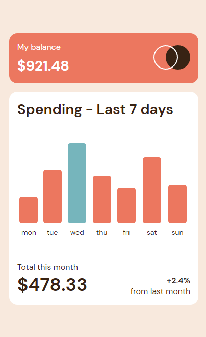

# Frontend Mentor - Expenses chart component solution

This is a solution to the [Expenses chart component challenge on Frontend Mentor](https://www.frontendmentor.io/challenges/expenses-chart-component-e7yJBUdjwt).

## Table of contents

- [Frontend Mentor - Expenses chart component solution](#frontend-mentor---expenses-chart-component-solution)
  - [Table of contents](#table-of-contents)
  - [Overview](#overview)
    - [The challenge](#the-challenge)
    - [Screenshot](#screenshot)
  - [My process](#my-process)
    - [Built with](#built-with)
    - [What I learned](#what-i-learned)
      - [1. Proper use of min-height](#1-proper-use-of-min-height)
      - [2. Intersection Obsever](#2-intersection-obsever)
    - [Useful resources](#useful-resources)
  - [Author](#author)

## Overview

### The challenge

Users should be able to:

- View the bar chart and hover over the individual bars to see the correct amounts for each day
- See the current day’s bar highlighted in a different colour to the other bars
- View the optimal layout for the content depending on their device’s screen size (Basically Responsiveness)
- See hover states for all interactive elements on the page
- **Bonus**: Use the JSON data file provided to dynamically size the bars on the chart

### Screenshot




## My process

### Built with

- Semantic HTML5 markup
- CSS custom properties
- Flexbox
- CSS Grid
- Mobile-first workflow

### What I learned

1.  proper use of min-height css propery
2.  effecient use of intersection observer
3.  difference between litterals and creating element

#### 1. Proper use of min-height

First of all I set the graph section height as fixed height, which caused me the problem on mobile screen when screen is too short then content overflows as you can see

```css
height: 215px;
```


I solved this error by using min-height property so I was able to solve this problem

```css
min-height: 215px;
```


#### 2. Intersection Obsever

Have you seen the smooth animation of those graphs which raise slowly. <br>
Of course Right <br>
I did that using Intersection observer and I used settimeout function for every element so Each element comes after proper time <br>
for that purpose I calculated time by **index\*200ms**
so every element come in sight after proper time

### Useful resources

[**Kewin Powel:**](https://www.youtube.com/kepowob) for intersection observer

## Author

- Frontend Mentor - [@yourusername](https://www.frontendmentor.io/profile/Abdul-Raouf-33)
